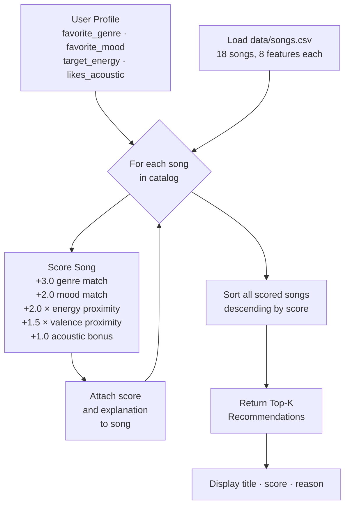

# 🎵 Music Recommender Simulation

## Project Summary

**App name: WaveSort 1.0**

In this project you will build and explain a small music recommender system.

Your goal is to:

- Represent songs and a user "taste profile" as data
- Design a scoring rule that turns that data into recommendations
- Evaluate what your system gets right and wrong
- Reflect on how this mirrors real world AI recommenders

This project simulates a content-based music recommender. It reads a small catalog of songs from a CSV file, compares each song's attributes against a user's stated preferences, and ranks songs by a computed score. The system prioritizes genre and mood matching, then fine-tunes results using proximity-based scoring on numeric features (energy and valence), so that songs with an intensity and emotional tone closest to what the user wants are ranked higher — not just songs with the highest or lowest raw values.

---

## How The System Works

Real-world music recommenders like Spotify and YouTube combine two main strategies: **collaborative filtering** (finding users with similar listening behavior and borrowing their taste) and **content-based filtering** (comparing a song's audio attributes directly to a user's preferences). This simulation focuses on the content-based approach — it doesn't need a crowd of users to learn from, it just looks at what each song sounds like and how well it matches what one user says they want. The system prioritizes genre as the strongest stable preference, then mood for emotional context, then uses proximity math on continuous features so that songs _closest_ to the user's target feel are ranked higher — not just songs that score high or low on a single axis.

### Data Flow



### Features Used by `Song`

| Feature        | Type      | Range     | Why It Matters                                                          |
| -------------- | --------- | --------- | ----------------------------------------------------------------------- |
| `genre`        | string    | 11 genres | Strongest structural preference signal                                  |
| `mood`         | string    | 12 moods  | Captures emotional and contextual fit                                   |
| `energy`       | float 0–1 | 0.22–0.98 | Intensity — scored by proximity to user's target                        |
| `valence`      | float 0–1 | 0.28–0.88 | Positiveness/darkness — rewarded when close to user's implied mood      |
| `acousticness` | float 0–1 | 0.03–0.97 | Acoustic vs. electronic character — bonus for users who prefer acoustic |
| `tempo_bpm`    | float     | 58–165    | Available for future workout/study context weighting                    |
| `danceability` | float 0–1 | 0.25–0.95 | Available; partially overlaps energy in most contexts                   |

### What `UserProfile` Stores

```python
UserProfile(
    favorite_genre = "rock",     # e.g. "lofi", "hip-hop", "classical"
    favorite_mood  = "intense",  # e.g. "chill", "romantic", "melancholic"
    target_energy  = 0.90,       # 0.0 = very calm, 1.0 = maximum intensity
    likes_acoustic = False       # True = bonus for acoustic-sounding tracks
)
```

**Critique — can this profile separate "intense rock" from "chill lofi"?**
Yes, clearly. An `intense rock` profile (`target_energy=0.90`) and a `chill lofi` profile (`target_energy=0.40`) diverge at every dimension:

- Genre match fires for different songs (3.0 pt gap)
- Mood match fires for different songs (2.0 pt gap)
- Energy proximity peaks at opposite ends of the scale (2.0 pt gap)

The limitation is that genre and mood are treated as independent binary signals. A "chill rock" song scores the same genre points for an `intense rock` user as a "intense rock" song does — the system doesn't understand that `rock + intense` is a tighter pairing than `rock + chill`. A real-world system would learn this joint relationship from user behavior.

### Algorithm Recipe (Scoring Rule — one song)

```
score = 3.0 × genre_match                           ← exact string match: 1 or 0
      + 2.0 × mood_match                            ← exact string match: 1 or 0
      + 2.0 × (1 − |song.energy − target_energy|)   ← proximity: 1.0=perfect, 0.0=opposite
      + 1.5 × (1 − |song.valence − target_valence|) ← proximity: inferred from mood
      + 1.0 × acoustic_bonus                        ← only if likes_acoustic=True
```

**Max possible score: 9.5**

**Weight rationale:**

- Genre (3.0) > Mood (2.0): genre is a stable long-term preference; mood is contextual. A jazz fan is _always_ a jazz fan; they don't always want a relaxed mood.
- Energy (2.0) = Mood (2.0): energy is the numeric version of the "vibe intensity" that mood captures categorically. Treating them equally avoids double-penalizing the same dimension.
- Valence (1.5): important but partially implied by mood, so weighted slightly lower to avoid over-penalizing songs that match genre + mood but differ on this secondary emotional axis.
- Acoustic bonus (1.0): a conditional add-on, not a proximity score. If the user doesn't care about acousticness, it contributes nothing and doesn't disadvantage electronic songs.

### Ranking Rule (choosing what to recommend)

The **Scoring Rule** answers _"how good is this one song for this user?"_ producing one number per song.
The **Ranking Rule** answers _"which songs should I recommend?"_ by applying the scoring rule across the full 18-song catalog, sorting by score descending, and returning the top-k. Both are necessary: scoring without ranking leaves you with a pile of numbers and no selection; ranking without a good scoring rule just sorts songs arbitrarily.

### Expected Bias

> **Genre over-dominance:** A 3.0 genre weight means a mediocre genre-matching song can always outscore a near-perfect cross-genre song. A jazz user might miss a beautifully mellow ambient track that fits their energy and valence perfectly, because it loses 3 points on genre alone. Real systems mitigate this with diversity constraints that force some cross-genre results into the top-k.

> **Binary genre matching:** `"pop"` and `"indie pop"` are treated as completely different genres (0 shared points), even though they overlap significantly. A pop fan gets no credit for indie pop songs. Fuzzy genre hierarchies or genre embeddings would fix this.

> **Acousticness asymmetry:** Only users with `likes_acoustic=True` can earn the acousticness bonus. Users who haven't declared acoustic preference are never rewarded for acoustic songs, making acoustic tracks systematically under-scored for them even if they'd enjoy them.

---

## Getting Started

### Setup

1. Create a virtual environment (optional but recommended):

   ```bash
   python -m venv .venv
   source .venv/bin/activate      # Mac or Linux
   .venv\Scripts\activate         # Windows

   ```

2. Install dependencies

```bash
pip install -r requirements.txt
```

3. Run the app:

```bash
python -m src.main
```

### Running Tests

Run the starter tests with:

```bash
pytest
```

You can add more tests in `tests/test_recommender.py`.

---

## Experiments You Tried

**Experiment 1 — What happens when you halve genre weight and double energy weight?**

I changed genre from 3.0 down to 1.5, and energy from 2.0 up to 4.0. For normal profiles like pop/happy, the top result stayed the same (Sunrise City), so it didn't break anything obvious. But the interesting part was the adversarial profile — someone who asked for ambient music with high energy (0.90). With the original weights, the system gave them _Spacewalk Thoughts_, which is a quiet, calm ambient track with energy of 0.28. That's basically the opposite of what they asked for. With the new weights, it gave them _Storm Runner_ instead — a rock song, but at least it has energy 0.91. So doubling the energy weight actually fixed a real bug for conflicting profiles. The tradeoff was that random high-energy songs from completely wrong genres started showing up in normal profiles too.

**Experiment 2 — Testing 7 different user profiles**

I ran the recommender against profiles that were designed to break it. A few results that stood out:

- **Unknown genre (blues):** Blues isn't in the catalog, so the system can never give a genre match. But it still found reasonable songs — lofi and ambient tracks that were chill and acoustic, which is what a blues listener would probably enjoy late at night. It worked better than I expected.
- **Only one song in a genre (folk):** The system always puts _Empty Porch_ first for any folk user, no matter what else they asked for. Ask for folk + high energy + uplifting? You get a sad slow folk song at energy 0.25 because it's the only folk song. This felt like the clearest failure case.
- **Chill lofi:** Two songs tied at the exact same score (9.37). Both were the right choice, so it wasn't a problem, but it showed that the ranking can be arbitrary when scores are equal.

**Experiment 3 — Does "Gym Hero" belong in a happy pop recommendation?**

Gym Hero (pop, intense, energy 0.93) kept showing up at #2 for the pop/happy profile. It matches on genre (3.0 points) and energy is close (1.74 points), but the mood is "intense" not "happy", so it misses the mood check. I initially thought this was wrong, but then I thought about it more — if you're a pop fan who likes high energy, Gym Hero actually does make sense. It's a gym pop song, not a sad ballad. The system is doing the right math, even if the mood label doesn't match.

---

## Limitations and Risks

**Genre weight is too strong for edge cases.** A 3.0 genre weight means a genre match can beat a song that fits better on every other feature. In the ambient + high energy test, the system recommended a calm ambient song over a much more energetic match, just because genre matched. For most normal users this isn't a problem, but for anyone with unusual or conflicting preferences it breaks down fast.

**There's only 1–2 songs per genre in the catalog.** This means the system doesn't really "recommend within a genre" — it just recommends that one song every single time. A folk user always gets _Empty Porch_. A metal user always gets _Iron Curtain_. There's no real choice being made; it's just the only option. You'd need at least 10 songs per genre for the ranking to mean something.

**"Pop" and "indie pop" are treated as totally different.** The system uses exact string matching for genre, so a pop fan gets zero credit for indie pop songs even though they're basically the same thing. In practice _Rooftop Lights_ only ever shows up via mood match, never genre, for a pop listener — which feels off.

**The system can't handle contradictions.** If you ask for folk + high energy, you get a sad quiet folk song, because that's the only folk song available. The system doesn't know those two things conflict — it just adds up the points and returns the highest number. A real app would push back or at least surface the conflict.

**No listening history, no learning.** This is a content-based system only. It doesn't get smarter over time, doesn't learn from skips or replays, and treats every session the same. Two users with completely different tastes could give the same input and get the same result.

---

## Reflection

Read and complete `model_card.md`:

[**Model Card**](model_card.md)

The thing that clicked for me during this project was realizing that a recommender doesn't actually "understand" music at all. It just adds up numbers. There's no part of the code that knows what a guitar sounds like, or that jazz and blues are related, or that "intense" and "aggressive" moods are close to each other. All it knows is: does this string equal that string, and how far apart are these two floats. And somehow, for a well-described user profile, that's enough to produce results that feel pretty accurate. The first time I ran the lofi/chill profile and got back _Midnight Coding_ and _Library Rain_ at the top, it genuinely felt right — like something I'd actually listen to at midnight. That surprised me.

The bias stuff was more uncomfortable to think about. The genre weight being 3.0 means users who happen to like genres with more songs in the catalog (lofi, pop) get better recommendations than users who like underrepresented genres (folk, metal, classical). That's not intentional, it's just a side effect of how the data is structured. In a real product with millions of users, that kind of imbalance quietly advantages some people and disadvantages others — not based on anything they did, just based on what genre they happen to like. Building this at small scale made that dynamic really visible in a way that reading about it never did.
